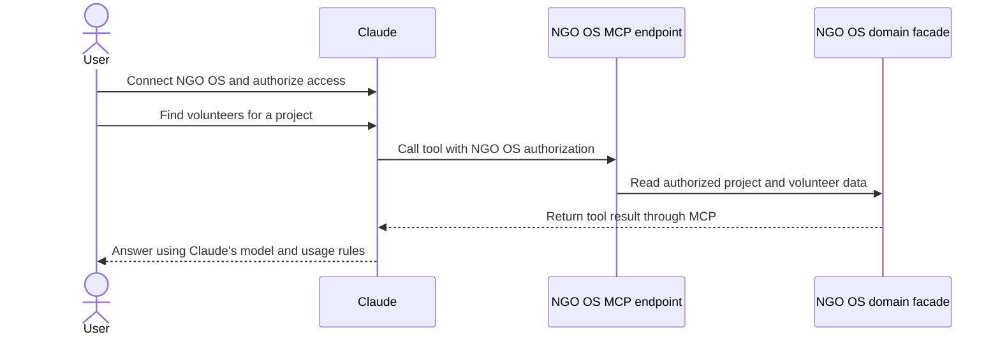

# Claude subscriptions in NGO OS

Research checked on 2026-10-03. This document describes integration options. It does not implement a connection or validate a live subscription.

## Recommendation

There is no documented, generally available way to turn a user's Claude subscription into API tokens for the NGO OS assistant. Claude subscriptions and Claude Console API billing are separate. An Anthropic API key gives access to Claude models, but does not spend a user's subscription allowance. See [Anthropic's explanation of separate API billing](https://support.claude.com/en/articles/9876003-i-have-a-paid-claude-subscription-pro-max-team-or-enterprise-plans-why-do-i-have-to-pay-separately-to-use-the-claude-api-and-console).

For the hackathon, keep the mocked connection described in [the product context](../product-context.md). A mock must not claim that a subscription pays for actual requests. For a real subscription workflow, an NGO OS MCP connector is the simplest candidate. Users would work inside Claude with NGO OS tools. For chat inside NGO OS, use a user-supplied API key with separate billing.

## What Anthropic currently supports

The official documents distinguish access, billing, and permission to build a product.

| Option | Subscription allowance | Where users work | Assessment |
| --- | --- | --- | --- |
| NGO OS collects a Claude OAuth token and calls inference | Not a supported product integration | NGO OS chat | Reject. The credential restrictions prohibit this flow. |
| User-supplied Anthropic API key | No. Separate API billing | NGO OS chat | Supported authentication route. Does not meet the subscription requirement. |
| NGO OS remote MCP connector | Claude controls the account's usage | Claude | Best candidate if users can work in Claude. Does not power NGO OS chat. |
| Hosted, unmodified Claude Code | User's plan and billing rules apply | User's own Claude Code terminal | Permitted under the hosting conditions. Requires a separate execution environment. |
| Custom Agent SDK assistant with subscription login | Billing documentation describes subscription usage, but product permission is restricted | NGO OS chat | Requires Anthropic approval and clarification before implementation. |

[Claude Code's credential rules](https://code.claude.com/docs/en/legal-and-compliance#authentication-and-credential-use) prohibit collecting Claude account credentials or session tokens and routing app requests through users' Free, Pro, or Max credentials. Authentication must complete through Anthropic's own flow. The same page explicitly allows end users to sign into an unmodified Claude Code binary, including on a hosting platform. Its [hosting conditions](https://code.claude.com/docs/en/legal-and-compliance#can-customers-offer-claude-code-in-their-products) require the commercial terms, preserve all built-in authentication methods, and require billing directly to the end user.

### The Agent SDK billing notice is not product approval

The [Agent SDK overview](https://code.claude.com/docs/en/agent-sdk/overview#get-started) requires prior approval for offering Claude login or subscription rate limits in a third-party product.

The Help Center's [Agent SDK plan notice](https://support.claude.com/en/articles/15036540-use-the-claude-agent-sdk-with-your-claude-plan) says a June 15 billing change was paused. Its current notice says Agent SDK, `claude -p`, and third-party app usage still draw from subscription limits. The monthly credits described below that notice are historical and are not available under the paused change.

These statements leave the permitted scope of a custom subscription-backed NGO OS assistant unclear. A billing description does not establish approval to collect credentials or offer our own login. Obtain written clarification for this exact architecture before committing to it. Do not infer approval from a successful token request or another tool's implementation. The Help Center's [login guidance for developers](https://support.claude.com/en/articles/13189465-log-in-to-your-claude-account#developers) also directs products to API keys or supported cloud providers.

## Where the integration would live

The committed main branch now has an assistant route and a workspace domain. `streamAssistant()` in `src/server/assistant/facade.ts` uses one server-owned `OPENROUTER_API_KEY` and the global `WORKSPACE_AI_MODEL`. It passes the model to `createWorkspaceAssistant()`, which runs workspace tools through the AI SDK and streams responses to assistant-ui. There is no per-user provider connection or credential store.

The assistant route does not enforce Clerk identity, and the workspace facade uses shared demo data without a user ownership parameter. Authentication and access isolation must precede any real per-user credential connection. The tRPC router and Drizzle schema remain empty.

| Existing location | Responsibility |
| --- | --- |
| `src/app/(api)/api/assistant/route.ts` | Thin streaming handler with a 60-second request limit |
| `src/server/assistant/facade.ts` | Message validation, model creation, tools, and response stream |
| `src/server/workspace/facade.ts` | Project, task, member, and conversation data |
| `src/server/api/context.ts` and `src/server/api/trpc.ts` | Clerk identity and authenticated procedures |
| `src/server/api/facade.ts` | Server-only entry point for the HTTP adapter |
| `src/server/db/schema.ts` | Future connection metadata, only when an integration needs storage |
| `src/env.ts` | Validated server configuration |
| `src/app/(workspace)/dashboard/` | Route-local settings and connection UI |
| `.oxlintrc.json` | Provider and facade import boundaries |

A future connection domain belongs behind `src/server/<domain>/facade.ts`, marked `server-only`. Routes validate requests and call the facade. React components receive connection status and available choices, never stored credentials. The assistant facade resolves the authenticated user's selected provider before it calls `createWorkspaceAssistant(model)`.

## A subscription workflow through MCP

[Claude supports custom remote MCP connectors](https://support.claude.com/en/articles/11175166-get-started-with-custom-connectors-using-remote-mcp) on subscription plans. Claude calls our tools and runs inference itself. The OAuth direction is Claude authenticating to NGO OS, not NGO OS obtaining a Claude subscription token. Remote connectors must be reachable from Anthropic's infrastructure.

The proposed implementation has these parts.

1. Add an authenticated MCP endpoint using an existing MCP server library. Keep the handler thin and call NGO OS domain facades.
2. Start with tools to list projects, read a project, and find volunteers. Add invitations only after permissions and user confirmation work.
3. Use a library-supported OAuth authorization server compatible with the app's Clerk identity. Verify connector discovery, token audience, scopes, expiry, and revocation. Clerk session cookies alone do not authenticate remote MCP calls.
4. Enforce the user's NGO OS permissions in every tool. Connection authorization does not grant unrestricted workspace access.
5. Put connector instructions and the server URL in settings. Claude handles model selection and subscription limits. NGO OS does not advertise a transferable token balance.

This is an architectural proposal, not a tested connector. The existing workspace facade can supply projects and members, but first needs authenticated access rules. Verification must cover unauthorized access, access across users, revoked authorization, and a real Claude connector conversation. A localhost-only demo needs a public development endpoint for a remote connector.

## Claude models inside NGO OS

For a separately billed API connection, the proposed domain stores one encrypted credential per authenticated user. Its public state is disconnected, connected, or needs attention. Storage holds the encryption key version and safe credential metadata. Model availability is a separate result from the provider, not proof of connection.

The facade connects, lists available models, disconnects, and resolves the credential for an authenticated request. The server validates access before marking the connection active. It passes the decrypted key directly to an official provider adapter. It never returns or logs the key. Encryption configuration goes through `src/env.ts`.

Settings show **Connect Anthropic API**, a model choice, and **Disconnect**. The connection form states that API usage has separate billing. Responses reuse the app's AI SDK and assistant-ui integration. Invalid credentials, unavailable models, exhausted API credit, and rate limits have distinct errors. An error must not silently switch billing to the app's shared key.

Useful integration checks cover credential isolation between users, connection validation, disconnect, and a request using the selected provider and model. No unit tests are needed for this proposal.

## A hosted Claude Code alternative

If the product must use subscriptions while remaining accessible from NGO OS, a separate per-user Claude Code terminal is the documented hosting route. This is more work than a settings connection.

The proposed host provides an isolated user-owned runtime, persistent private storage, an authenticated terminal connection, resource limits, and lifecycle management. The user signs in through the binary's own flow. NGO OS does not extract the resulting credential for an AI SDK provider. Sharing the server's home directory or one process account between users is unsuitable.

[Claude Code authentication](https://code.claude.com/docs/en/iam#log-in-to-claude-code) handles browser login, container login codes, and logout. [Claude Code model configuration](https://code.claude.com/docs/en/model-config) handles model selection and account restrictions. A subscription does not guarantee every model or unlimited tokens.

The app has no terminal transport or runtime manager today. Design this as a separate hosted workspace service before adding database tables or settings controls. Turning its output into the NGO OS assistant would return to the unresolved custom-product question. The hosting exception alone does not establish permission for that design.

## Remaining decisions

The product choice is whether users need chat inside NGO OS or can work with NGO OS tools inside Claude. Those experiences require different integrations. The hackathon scope already selects a mock.

A custom subscription-backed assistant needs Anthropic's written approval, an approved authentication flow, confirmed billing behavior, and a live per-user isolation check. None of those gates were validated in this research. Recheck the official documents before implementation because the SDK billing policy is under revision.
